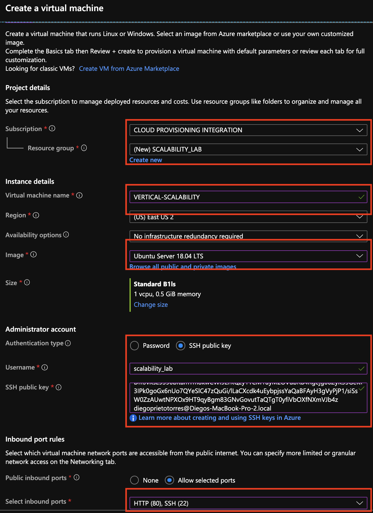
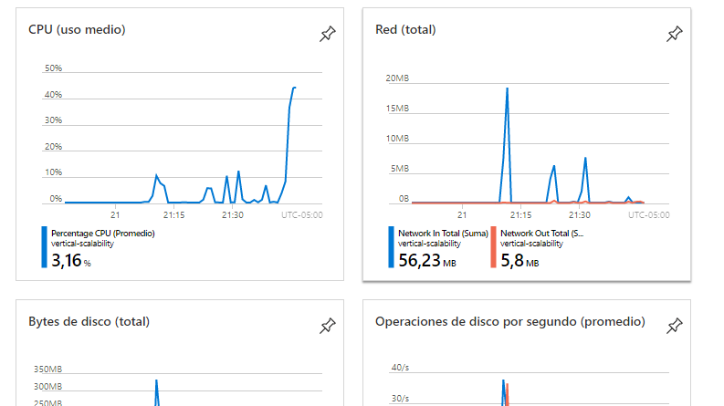
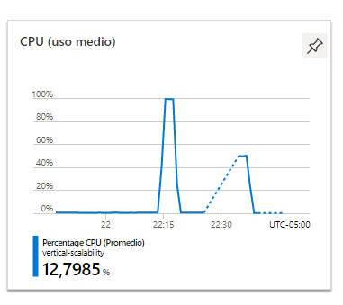
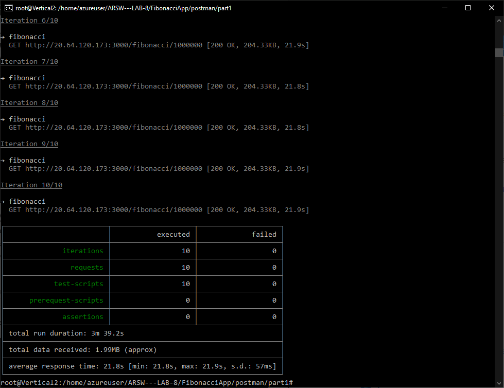
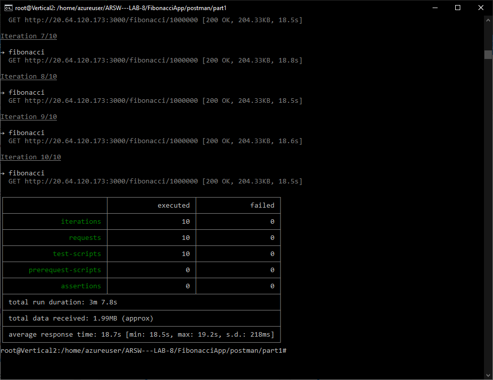
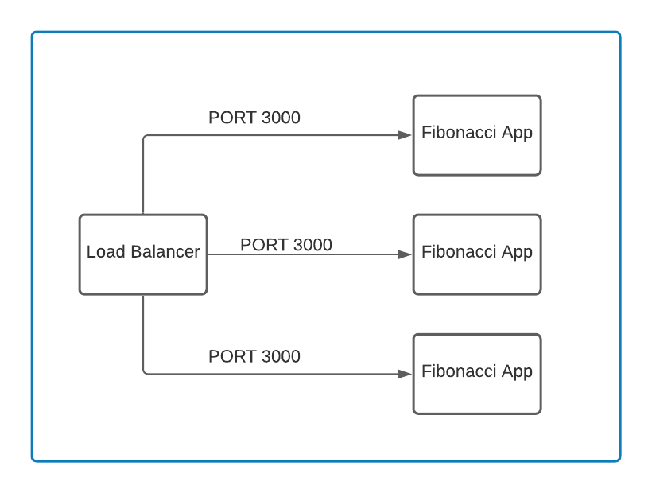

### Escuela Colombiana de Ingeniería
### Arquitecturas de Software - ARSW

## Escalamiento en Azure con Maquinas Virtuales, Sacale Sets y Service Plans

### Dependencias
* Cree una cuenta gratuita dentro de Azure. Para hacerlo puede guiarse de esta [documentación](https://azure.microsoft.com/en-us/free/search/?&ef_id=Cj0KCQiA2ITuBRDkARIsAMK9Q7MuvuTqIfK15LWfaM7bLL_QsBbC5XhJJezUbcfx-qAnfPjH568chTMaAkAsEALw_wcB:G:s&OCID=AID2000068_SEM_alOkB9ZE&MarinID=alOkB9ZE_368060503322_%2Bazure_b_c__79187603991_kwd-23159435208&lnkd=Google_Azure_Brand&dclid=CjgKEAiA2ITuBRDchty8lqPlzS4SJAC3x4k1mAxU7XNhWdOSESfffUnMNjLWcAIuikQnj3C4U8xRG_D_BwE). Al hacerlo usted contará con $200 USD para gastar durante 1 mes.

### Parte 0 - Entendiendo el escenario de calidad

Adjunto a este laboratorio usted podrá encontrar una aplicación totalmente desarrollada que tiene como objetivo calcular el enésimo valor de la secuencia de Fibonnaci.

**Escalabilidad**
Cuando un conjunto de usuarios consulta un enésimo número (superior a 1000000) de la secuencia de Fibonacci de forma concurrente y el sistema se encuentra bajo condiciones normales de operación, todas las peticiones deben ser respondidas y el consumo de CPU del sistema no puede superar el 70%.

### Parte 1 - Escalabilidad vertical

1. Diríjase a el [Portal de Azure](https://portal.azure.com/) y a continuación cree una maquina virtual con las características básicas descritas en la imágen 1 y que corresponden a las siguientes:
    * Resource Group = SCALABILITY_LAB
    * Virtual machine name = VERTICAL-SCALABILITY
    * Image = Ubuntu Server 
    * Size = Standard B1ls
    * Username = scalability_lab
    * SSH publi key = Su llave ssh publica



2. Para conectarse a la VM use el siguiente comando, donde las `x` las debe remplazar por la IP de su propia VM.

    `ssh scalability_lab@xxx.xxx.xxx.xxx`

3. Instale node, para ello siga la sección *Installing Node.js and npm using NVM* que encontrará en este [enlace](https://linuxize.com/post/how-to-install-node-js-on-ubuntu-18.04/).
4. Para instalar la aplicación adjunta al Laboratorio, suba la carpeta `FibonacciApp` a un repositorio al cual tenga acceso y ejecute estos comandos dentro de la VM:

    `git clone <your_repo>`

    `cd <your_repo>/FibonacciApp`

    `npm install`

5. Para ejecutar la aplicación puede usar el comando `npm FibinacciApp.js`, sin embargo una vez pierda la conexión ssh la aplicación dejará de funcionar. Para evitar ese compartamiento usaremos *forever*. Ejecute los siguientes comando dentro de la VM.

    `npm install forever -g`

    `forever start FibinacciApp.js`

6. Antes de verificar si el endpoint funciona, en Azure vaya a la sección de *Networking* y cree una *Inbound port rule* tal como se muestra en la imágen. Para verificar que la aplicación funciona, use un browser y user el endpoint `http://xxx.xxx.xxx.xxx:3000/fibonacci/6`. La respuesta debe ser `The answer is 8`.


7. La función que calcula en enésimo número de la secuencia de Fibonacci está muy mal construido y consume bastante CPU para obtener la respuesta. Usando la consola del Browser documente los tiempos de respuesta para dicho endpoint usando los siguintes valores:
    * 1000000
    * 1010000
    * 1020000
    * 1030000
    * 1040000
    * 1050000
    * 1060000
    * 1070000
    * 1080000
    * 1090000    

8. Dírijase ahora a Azure y verifique el consumo de CPU para la VM. (Los resultados pueden tardar 5 minutos en aparecer).


9. Ahora usaremos Postman para simular una carga concurrente a nuestro sistema. Siga estos pasos.
    * Instale newman con el comando `npm install newman -g`. Para conocer más de Newman consulte el siguiente [enlace](https://learning.getpostman.com/docs/postman/collection-runs/command-line-integration-with-newman/).
    * Diríjase hasta la ruta `FibonacciApp/postman` en una maquina diferente a la VM.
    * Para el archivo `[ARSW_LOAD-BALANCING_AZURE].postman_environment.json` cambie el valor del parámetro `VM1` para que coincida con la IP de su VM.
    * Ejecute el siguiente comando.

    ```
    newman run ARSW_LOAD-BALANCING_AZURE.postman_collection.json -e [ARSW_LOAD-BALANCING_AZURE].postman_environment.json -n 10 &
    newman run ARSW_LOAD-BALANCING_AZURE.postman_collection.json -e [ARSW_LOAD-BALANCING_AZURE].postman_environment.json -n 10
    ```

10. La cantidad de CPU consumida es bastante grande y un conjunto considerable de peticiones concurrentes pueden hacer fallar nuestro servicio. Para solucionarlo usaremos una estrategia de Escalamiento Vertical. En Azure diríjase a la sección *size* y a continuación seleccione el tamaño `B2ms`.


11. Una vez el cambio se vea reflejado, repita el paso 7, 8 y 9.
12. Evalue el escenario de calidad asociado al requerimiento no funcional de escalabilidad y concluya si usando este modelo de escalabilidad logramos cumplirlo.
13. Vuelva a dejar la VM en el tamaño inicial para evitar cobros adicionales.

**Preguntas**

1. ¿Cuántos y cuáles recursos crea Azure junto con la VM?
> Se crean varios recursos:
	- Direcciones IP publicas y privadas
	- Virtual Network
	- Grupos de seguridad de red
2. ¿Brevemente describa para qué sirve cada recurso?
> Virtual Network: Es el bloque de contruccion para una red privada en Azure. Permite que muchos tipos de recursos de Azure, como las maquinas virtuales de Azure puedan comunicarse de forma segura entre si. Basicamente es similar a una red tradicional que opera su propio centro de datos.
> IP publica: Permiten que los recursos de internet se comuniquen con los recursos de Azure, tambien permiten que los recursos de Azure se comuniquen con los servicios de internet.
> IP privada: Permite la comunicacion con los recursos de Azure:
	- Maquinas virtuales
	- Load Balancers
	- Redes virtualesRed local de una pasarela de VPN
> Grupo de seguridad de red: Contiene reglas de seguridad que permiten o deniegan el trafico de red entrante o saliente. Se puede especificar para cada regla el origen, destino, puerto y protocolo.
3. ¿Al cerrar la conexión ssh con la VM, por qué se cae la aplicación que ejecutamos con el comando `npm FibonacciApp.js`? ¿Por qué debemos crear un *Inbound port rule* antes de acceder al servicio?
> Ya que al ejecutar a traves de ssh los procesos quedan conectados a esta conexion previa, asi que cuando se cierre los procesos cierran su ejecucion. Esta regla permite el acceso publico a un puerto especifico de la maquina virtual, asi poder ejecutar la aplicacion por este puerto de manera accesible.
4. Adjunte tabla de tiempos e interprete por qué la función tarda tando tiempo.

| B1Is |
| Valor | Tiempo |
| ------------- | ------------- |
| 1000000 | 22.96  |
| 1010000 | 21.28  |
| 1020000 | 36.51  |
| 1030000 | 37.9  |
| 1040000 | 22.82  |
| 1050000 | 23.89  |
| 1060000 | 23.89  |
| 1070000 | 24.41  |
| 1080000 | 25.49  |
| 1090000 | 25.67  |

| B2ms |
| Valor | Tiempo |
| ------------- | ------------- |
| 1000000 | 14.95  |
| 1010000 | 15.74  |
| 1020000 | 19.91  |
| 1030000 | 19.45  |
| 1040000 | 16.75  |
| 1050000 | 16.45  |
| 1060000 | 17.23  |
| 1070000 | 17.06  |
| 1080000 | 24.48  |
| 1090000 | 17.5  |

5. Adjunte imágen del consumo de CPU de la VM e interprete por qué la función consume esa cantidad de CPU.
> 
> 
> Consume la cantidd de CPUya que la implementacion no es tan eficaz el cual llega a usar demasiado recursos para hacer iteraciones
6. Adjunte la imagen del resumen de la ejecución de Postman. Interprete:
    * Tiempos de ejecución de cada petición.
    * Si hubo fallos documentelos y explique.
	> 
	> 
	> Se pueden observar fallos de desconexion y tiempo de ejecucion. Pero cuando realizamos el aumento los tiempos disminuyen y varian.
7. ¿Cuál es la diferencia entre los tamaños `B2ms` y `B1ls` (no solo busque especificaciones de infraestructura)?
> Su diferencia es la capacidad en memoria, uno con 0.5 Gb y otro con 8Gb cada uno respectivamente. Ademas de una gran diferencia en la CPU, ya que si vemos B2ms es el doble de B1ls generando esto que el precio por mes sea mucho mas de uno que de otro por la cantidad de recursos que brinda este servicio. Dicho esto se puede intuir que tambien su rendimiento mejora de una gran manera con una mejor optimizacion de caracteristicas tecnicas que posee cada uno de estos.
8. ¿Aumentar el tamaño de la VM es una buena solución en este escenario?, ¿Qué pasa con la FibonacciApp cuando cambiamos el tamaño de la VM?
> No lo es. Debido a que las pruebas siguen fallando por una mala implementacion de la aplicacion, pero por otra parte podemos notar un menor consumo de CPU debido que es mas grande.
9. ¿Qué pasa con la infraestructura cuando cambia el tamaño de la VM? ¿Qué efectos negativos implica?
> Cuando ocurre algun cambio fisico la VM debe ser reiniciada por completo por lo que algu servicio que este en ejecucion se vera afectado por lo que se refleja un efecto negativo en la disponibilidad de los servicios.
10. ¿Hubo mejora en el consumo de CPU o en los tiempos de respuesta? Si/No ¿Por qué?
> Hubo una mejora de casi el 40%.
11. Aumente la cantidad de ejecuciones paralelas del comando de postman a `4`. ¿El comportamiento del sistema es porcentualmente mejor?
> No, ya que podemos seguir observando la msima cantidad de erores al momento de ejecutarlo.

### Parte 2 - Escalabilidad horizontal

#### Crear el Balanceador de Carga

Antes de continuar puede eliminar el grupo de recursos anterior para evitar gastos adicionales y realizar la actividad en un grupo de recursos totalmente limpio.

1. El Balanceador de Carga es un recurso fundamental para habilitar la escalabilidad horizontal de nuestro sistema, por eso en este paso cree un balanceador de carga dentro de Azure tal cual como se muestra en la imágen adjunta.


2. A continuación cree un *Backend Pool*, guiese con la siguiente imágen.


3. A continuación cree un *Health Probe*, guiese con la siguiente imágen.


4. A continuación cree un *Load Balancing Rule*, guiese con la siguiente imágen.


5. Cree una *Virtual Network* dentro del grupo de recursos, guiese con la siguiente imágen.

img_2

#### Crear las maquinas virtuales (Nodos)

Ahora vamos a crear 3 VMs (VM1, VM2 y VM3) con direcciones IP públicas standar en 3 diferentes zonas de disponibilidad. Después las agregaremos al balanceador de carga.

1. En la configuración básica de la VM guíese por la siguiente imágen. Es importante que se fije en la "Avaiability Zone", donde la VM1 será 1, la VM2 será 2 y la VM3 será 3.


2. En la configuración de networking, verifique que se ha seleccionado la *Virtual Network*  y la *Subnet* creadas anteriormente. Adicionalmente asigne una IP pública y no olvide habilitar la redundancia de zona.


3. Para el Network Security Group seleccione "avanzado" y realice la siguiente configuración. No olvide crear un *Inbound Rule*, en el cual habilite el tráfico por el puerto 3000. Cuando cree la VM2 y la VM3, no necesita volver a crear el *Network Security Group*, sino que puede seleccionar el anteriormente creado.


4. Ahora asignaremos esta VM a nuestro balanceador de carga, para ello siga la configuración de la siguiente imágen.


5. Finalmente debemos instalar la aplicación de Fibonacci en la VM. para ello puede ejecutar el conjunto de los siguientes comandos, cambiando el nombre de la VM por el correcto

```
git clone https://github.com/daprieto1/ARSW_LOAD-BALANCING_AZURE.git

curl -o- https://raw.githubusercontent.com/creationix/nvm/v0.34.0/install.sh | bash
source /home/vm1/.bashrc
nvm install node

cd ARSW_LOAD-BALANCING_AZURE/FibonacciApp
npm install

npm install forever -g
forever start FibonacciApp.js
```

Realice este proceso para las 3 VMs, por ahora lo haremos a mano una por una, sin embargo es importante que usted sepa que existen herramientas para aumatizar este proceso, entre ellas encontramos Azure Resource Manager, OsDisk Images, Terraform con Vagrant y Paker, Puppet, Ansible entre otras.

#### Probar el resultado final de nuestra infraestructura

1. Porsupuesto el endpoint de acceso a nuestro sistema será la IP pública del balanceador de carga, primero verifiquemos que los servicios básicos están funcionando, consuma los siguientes recursos:

```
http://52.155.223.248/
http://52.155.223.248/fibonacci/1
```

2. Realice las pruebas de carga con `newman` que se realizaron en la parte 1 y haga un informe comparativo donde contraste: tiempos de respuesta, cantidad de peticiones respondidas con éxito, costos de las 2 infraestrucruras, es decir, la que desarrollamos con balanceo de carga horizontal y la que se hizo con una maquina virtual escalada.

3. Agregue una 4 maquina virtual y realice las pruebas de newman, pero esta vez no lance 2 peticiones en paralelo, sino que incrementelo a 4. Haga un informe donde presente el comportamiento de la CPU de las 4 VM y explique porque la tasa de éxito de las peticiones aumento con este estilo de escalabilidad.

```
newman run ARSW_LOAD-BALANCING_AZURE.postman_collection.json -e [ARSW_LOAD-BALANCING_AZURE].postman_environment.json -n 10 &
newman run ARSW_LOAD-BALANCING_AZURE.postman_collection.json -e [ARSW_LOAD-BALANCING_AZURE].postman_environment.json -n 10 &
newman run ARSW_LOAD-BALANCING_AZURE.postman_collection.json -e [ARSW_LOAD-BALANCING_AZURE].postman_environment.json -n 10 &
newman run ARSW_LOAD-BALANCING_AZURE.postman_collection.json -e [ARSW_LOAD-BALANCING_AZURE].postman_environment.json -n 10
```

**Preguntas**

* ¿Cuáles son los tipos de balanceadores de carga en Azure y en qué se diferencian?, ¿Qué es SKU, qué tipos hay y en qué se diferencian?, ¿Por qué el balanceador de carga necesita una IP pública?
> Hay 2 tipos de balanceadores de carga, el balenceador publico y el privado los cuales se diferencian en que el balanceador publico esta hecho para dar conexiones de salida a las maquinas virtuales mientras que el privado se utiliza para realizar el equilibrio de carga dentro de una red virtual
* ¿Cuál es el propósito del *Backend Pool*?
> Es un componente critico del balenceador de carga. El pool de backend define el grupo de recursos que servira el trafico para una regla de equilibrio de carga determinada.
* ¿Cuál es el propósito del *Health Probe*?
> Ayudar a que el Load Balancer detecte el estado del extremo del backend. La configuracion determina que instancias del backend pool reciben nuevos flujos.
* ¿Cuál es el propósito de la *Load Balancing Rule*? ¿Qué tipos de sesión persistente existen, por qué esto es importante y cómo puede afectar la escalabilidad del sistema?.
> Define el trafico de red por medio de las maquinas virtuales, permitiendo sesiones que no tienen una persistencia definida lo cual significa que cuando se realice una peticion llegara a un usuario previo y no a uno nuevo.
* ¿Qué es una *Virtual Network*? ¿Qué es una *Subnet*? ¿Para qué sirven los *address space* y *address range*?
> Es el bloque de creacion fundamenal de una red privada en Azure, tambien permite muchos tipos de recursos como Azure VM para comunicar de forma segura entre usuarios con internet y con redes locales.
> Es un rango de direcciones, el cual se utiliza normalmente cuando se tienen redes muy grandes.
> Son aquellas direcciones de red asignables dentro de una maquina virtual y address range son las redes asignadas dentro de una subnet.
* ¿Qué son las *Availability Zone* y por qué seleccionamos 3 diferentes zonas?. ¿Qué significa que una IP sea *zone-redundant*?
> Es una oferta de alta disponibilidad que protege sus aplicaciones y datos de los fallos del centro de datos. Las zonas de disponibilidad son ubicaciones fisicas dentro de una region de Azure.
> Signigica que es una direccion que replica las peticiones y datos por medio de Availability Zone.
* ¿Cuál es el propósito del *Network Security Group*?
> Sirve para filtrar el trafico de red hacia y desde los recursos en una red virtual en Azure. Este contiene reglas de seguridad que permiten o deniegan el trafico de red entre el trafico saliente de varios recursos de Azure. Para cada una de estas reglas se puede especificar el origen, destino, puerto y protocolo que se desea implementar.
* Informe de newman 1 (Punto 2)
> 
> 
* Presente el Diagrama de Despliegue de la solución.
> 


